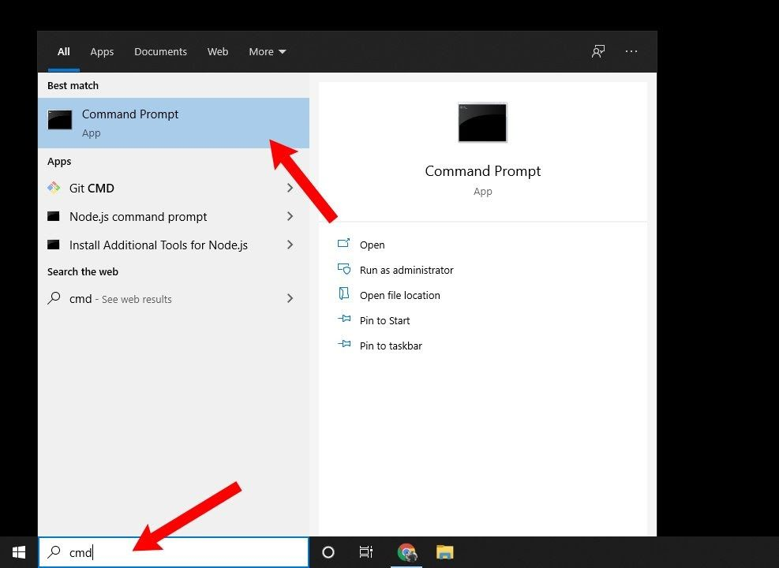

# 参与 Wiki

## 1. 配置编辑环境

1. 进入 [https://github.com/Glimmer14/DNL1905-Wiki](https://github.com/Glimmer14/DNL1905-Wiki)仓库，点击 fork。


2. 继续点击 Create fork。


3. 在 fork 的仓库里点击 code 之后复制链接。


4. 在搜索栏中输入 `cmd`，然后点击`命令提示符`打开 cmd。



5. 在 cmd 中输入 `git clone + 刚刚复制的链接`后，按下回车，将网站源码下载至本地，比如样例所示链接为`https://github.com/Amy-Amelia/DNL1905-Wiki.git`，则输入（怕你不知道提醒一下，代码框最右边有复制按钮）：
```bash
git clone https://github.com/Amy-Amelia/DNL1905-Wiki.git
```

6. 输入以下代码进入文件目录。
```bash
cd DNL1905-Wiki
```

7. 进入目录后输入复制粘贴以下代码，配置 Python 虚拟环境并安装依赖:
```bash
python3 -m venv venv
.\venv\Scripts\activate
pip install -r requirements.txt
```

8. 输入 `code .` 以在 vscode 里打开项目。
```bash
code .
```

9. 在 vscode 界面输入 `ctrl` + `J` 打开 terminal 终端。
10. 在终端里输入 `.\venv\Scripts\activate` 激活环境。
11. 输入 `mkdocs serve` 来启动本地服务器。
12. 按住 `ctrl` 点击弹出的 http://127.0.0.1:8000 链接，跳转至浏览器可对项目进行预览。

至此，编辑项目的环境就搭建好啦！

---

## 2. 编辑内容

接下来就可以使用 markdown 格式进行内容编辑，如果还不会 markdown 语法，可以先看[markdown 语法](markdown.md)部分，能被识别为 wiki 的 markdown 文件应在文件的开头插入 [YAML Front Matter](markdown.md#yaml-front-matter)。

在 vscode 左侧的的 docs 文件中选择对应的文件夹创建新的 markdown 文件（以`.md`结尾的文件）。使用 markdown 语法进行编辑。

编辑好后，需要手动在仓库首级的 `mkdocs.yml` 中设置导航。
例如在 **参与 Wiki** 中增加 **准备工作** 的话（ **准备工作** 对应的 md 文件路径为 `docs/how_to_edit/pre_work.md`），且希望放在 **前言** 和 **修改 Wiki** 之间，请在 `nav` 中增加如下高亮内容：

```yaml hl_lines="5"
nav:
  - 首页: index.md
  - 参与 Wiki: 
      - 前言: how_to_edit/say_something.md
      - 准备工作: how_to_edit/pre_work.md
      - 修改 Wiki: how_to_edit/how_to_do.md
      - Markdown 语法: how_to_edit/markdown.md
```

---

## 3. 提交修改并推送到你的 Fork 仓库
编好内容后，在 terminal 中按下 `ctrl` + `c` 以退出 mkdoc serve，输入以下内容将项目提交到 fork 的仓库:

1. 输入:
``` bash
git add .
```
2. 输入以下内容简述你的修改:
``` bash
git commit -m "简要描述你的修改" # 次处简述你的改动
```
3. push 到仓库中:
``` bash
git push
```

---

#### 4. 提交 PR


