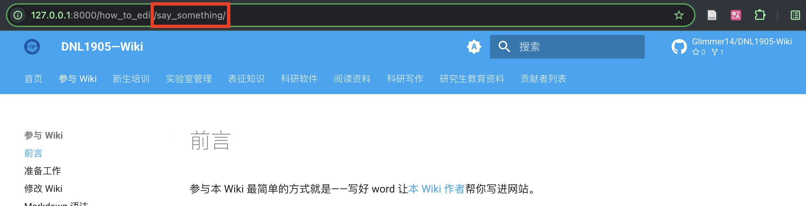

## Markdown 语法

Markdown 是一种标记语言，和代码一样，可以用纯文本的形式来书写。其使用的常用标记符号不超过十个，可以让人专注于文字而不是排版，并且也可以方便地导出为 HTML、PDF 等格式。

### 基本语法


!!! warning "注意"
    插入图片时切勿使用本地路径，否则在 Wiki 上无法查看。

可参考 [markdown 教程](https://www.markdownguide.org/basic-syntax/) 与 [练习](https://www.markdowntutorial.com/) 来学习基本语法。

!!! warning "注意"
    要引用同一篇 Wiki 中的小标题（二至六级标题）可以通过 `[sub title](#sub-title)` 来引用。不过需要注意，要把小标题中的空格用 `-` 代替，所有大写字母改成小写，且忽略 `.` , `&` 等特殊符号。
    
    请注意，如被引用的链接中包含中文，Mkdocs 不能提供良好支持。请通过添加别名的方式来实现，比如要链接到[1. Fork Wiki 文档所在仓库](#1-fork-Wiki-repo)，请在 `#### 1. Fork Wiki 文档所在仓库` 后添加 `{ #1-fork-Wiki-repo }`:

    ```
      #### 1. Fork Wiki 文档所在仓库 { #1-fork-Wiki-repo }
    ```

    在引用时，请使用别名进行链接 `[1. Fork Wiki 文档所在仓库](#1-fork-Wiki-repo)`。

### GFM 扩展语法

GFM(GitHub Flavored Markdown) 是 GitHub 所使用的 Markdown 扩展语法。

#### 清单

```gfm
- [ ] 未完成列表
- [x] 已完成列表
```

- [ ] 未完成列表
- [x] 已完成列表

#### 表情

```gfm
:eyeglasses: :+1:
```

:eyeglasses: :+1:

### Wiki 扩展语法

标注 * 的部分可以不去注意

#### YAML Front Matter

##### 加入标题

只有在 `markdown` 文件的头部加入 `YAML Front Matter` 部分，才能使你写的 Wiki 展示在网页上。因此最简单的，请在 `YAML Front Matter` 中加入 `title`，如下所示：

```yaml
---
title: getting-started
---
```

##### 添加作者

在 `YAML Front Matter` 中加入 `authors` 即可添加作者，多个作者用 yaml 语法的列表表示：

```yaml
---
title: getting-started
authors: one author
---
```

```yaml
---
title: getting-started
authors:
  - author1
  - author2
---
```

##### 开启评论功能

对创建页面的编辑者来说，通常情况下请开启评论功能、以便读者可以快速提交反馈或评论，即在 `YAML Front Matter` 部分增加一行：

```yaml
---
...
comments: true
---
```

#### 数学公式

数学公式可以用 LaTeX 语法来书写，两端用 `$`(一般用于行内公式) 或 `$$`(会使公式居中显示) 来标记，如 `$E=mc^2$` 可表示 $E=mc^2$ 。

```gfm
$$
E[\rho] = T_s[\rho] + \int \mathrm{d}r\ v_{\rm ext}(r)\rho(r) + V_{H}[\rho] + E_{\rm xc}[\rho]
$$
```

$$
E[\rho] = T_s[\rho] + \int \mathrm{d}r\ v_{\rm ext}(r)\rho(r) + V_{H}[\rho] + E_{\rm xc}[\rho]
$$

要表示多行公式，需要使用 `aligned`，并要在行尾部加 `\\`。

```gfm
$$
\begin{aligned} \dot{x} &= \sigma(y-x) \\
\dot{y} &= \rho x - y - xz \\
\dot{z} &= -\beta z + xy \end{aligned} 
$$
```

$$
\begin{aligned} \dot{x} &= \sigma(y-x) \\
\dot{y} &= \rho x - y - xz \\
\dot{z} &= -\beta z + xy \end{aligned}
$$

若实现给公式编号等功能，可参照 LaTeX 的做法。

#### 化学式与化学反应式

此功能通过 LaTeX 的 mhchem 插件来实现，使用上与数学公式输入相近，都需要通过 `$` 或 `$$` 来标记。

|                          源码                          |                  化学式与化学反应式                  |
| :----------------------------------------------------: | :--------------------------------------------------: |
|                    `$\ce{Mg(OH)2}$`                    |                    $\ce{Mg(OH)2}$                    |
|                    `$\ce{CrO4^2-}$`                    |                    $\ce{CrO4^2-}$                    |
|                 `$\ce{[Cu(NH3)4]^2+}$`                 |                 $\ce{[Cu(NH3)4]^2+}$                 |
|                  `$\ce{CoCl2.6H2O}$`                   |                  $\ce{CoCl2.6H2O}$                   |
|                `$\ce{^{227}_{90}Th+}$`                 |                $\ce{^{227}_{90}Th+}$                 |
|                    `$\ce{C2H5-OH}$`                    |                    $\ce{C2H5-OH}$                    |
|                   `$\ce{CH3CH=CH2}$`                   |                   $\ce{CH3CH=CH2}$                   |
|                     `$\ce{HC#CH}$`                     |                     $\ce{HC#CH}$                     |
| `$\ce{CaCO3 ->[900\,{}^{\circ}\mathrm{C}] CaO + CO2}$` | $\ce{CaCO3 ->[900\,{}^{\circ}\mathrm{C}] CaO + CO2}$ |
|       `$\ce{H2PO4- <=>C[OH-][H+] H+ + HPO4^2-}$`       |       $\ce{H2PO4- <=>C[OH-][H+] H+ + HPO4^2-}$       |

#### 上下标

一般情况下可以用 `<sup></sup>` 表示上标，用 `<sub></sub>` 表示下标，如 ai<sup>2</sup>-kit 可用 `ai<sup>2</sup>-kit` 表示。

#### 提示

```markdown
!!! tldr "title"
    TLDR means too long, didn't read.
```

改变 `tldr` 即可使用不同的提示类型，比如

!!! tldr "Use `tldr` for this."
    TLDR means too long, didn't read
!!! tip "Use `tip` for this."
    This is a tip.
!!! info "Use `info` for this."
    This is a piece of information, or you can use todo.
!!! question "Use `question` for this."
    This is a question.
!!! warning "Use `warning` for this."
    This is a warning
!!! danger "Use `danger` for this."
    This alerts danger!
!!! success "Use `success` for this."
    This alerts success

#### 按钮* { #button }

```markdown
[Subscribe to our newsletter](#){ .md-button }
```

目前支持按钮两种颜色方案的配置。

```
[default](#){ .md-button }
[primary](#){ .md-button .md-button--primary }
```

[default](#){ .md-button }
[primary](#){ .md-button .md-button--primary }

#### 流程图*

流程图可以用来表示工作流或者步骤等：

````markdown

````


### 引用本网站的其他 Wiki

使用

```markdown
[title](relavent/path/to/file.md)
```

即可在 Wiki 中引用本网站的其他 Wiki 。只需将 `relavent/path/to/file.md` 改成想要引用的 Wiki 相对此文档的 **相对路径**。

比如，要想引用 `参与 Wiki /前言` 这篇 Wiki，则只需把 `relavent/path/to/file.md` 换成 `../how_to_edit/say_something.md`。



!!! warning
    注意这里推荐使用的是相对路径，可不改变同级目录结构。如需修改上级目录结构需要对应更改。


## 参考资料*

要使用更多功能，请参考[mkdocs-material官方文档](https://squidfunk.github.io/mkdocs-material)。

当然，想要快速获得支持，也可以联系作者。