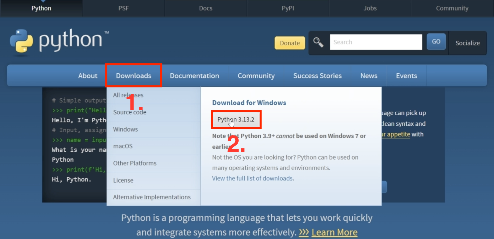
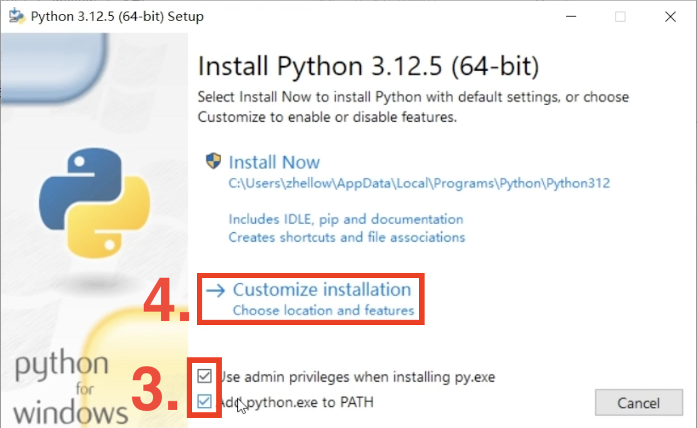

# 准备工作

你需要以下准备工作以参与修改 [DNL1905-Wiki](../index.md):

* [:simple-python: 安装 Python](#install-Python)
* [:material-microsoft-visual-studio-code: 安装 Visual Studio Code](#install-vscode)
* [:simple-github: 注册 GitHub 账户](#sign-in-Github)

## 安装 Python { #install-Python }

1. 打开[:simple-python: Python 官网](https://www.python.org/downloads/)
2. 找到 **Downloads**，选择其下 **python** 版本，点击下载。

3. 双击下载的安装包，勾选 **Use admin privileges when installing py.exe** 以及 **Add python.exe to PATH**。

4. 后续建议全部按照 **默认选项** 安装即可，**不建议更改安装路径**（题外话：同时建议任何使用固态硬盘的电脑不进行分盘）。

## 安装 Visual Studio Code { #install-vscode }
推荐阅读: [https://www.arryblog.com/guide/vscode.html](https://www.arryblog.com/guide/vscode.html)
!!! warning
    只需看 **vscode 安装** 部分即可，其余部分可忽略。

## 注册 Github 账户 { #sign-in-Github }
推荐阅读: [https://blog.csdn.net/weixin_51674304/article/details/121525251](https://blog.csdn.net/weixin_51674304/article/details/121525251)
